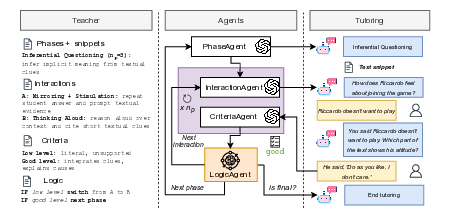

# Claire

<p align="center">
  
</p>

This is the repository of the paper "CLAIRE: a Controllable LLM Tutoring Framework for Reading Comprehension".  
Claire is a teacher-configurable framework that operationalizes guided reading by decomposing the pedagogical procedure into four components, i.e., pedagogical phases, interaction moves, assessment criteria, and transition logic, authored by teachers and executed at runtime through a structured multi-agent dialogue controller.

# How to run Claire

Run the following commands to copy the repository and create the `db/` directory (where the `sqlite3` database is stored)

```
git clone https://github.com/softlab-unimore/Claire.git
cd Claire
mkdir db
```

Create the Python environment and the install the requirements

```
python3 -m venv env
source env/bin/activate
pip install -r requirements.txt
```

The tests in the paper have been run with 3.12.4.  
Copy the `sample_config/.env` file in the current directory and fill the requested environment variables.  
After that, apply the migrations into your django setup and run the server

```
python3 manage.py migrate
python3 manage.py runserver
```

Claire's login page can then be accessed from `localhost:8000/activity/`  
In this repository, we also provide the docker files to run Claire with docker.

# How to use the system

<p align="center">
  
</p>

With Claire, a teacher can create classes and make other students join their classes. For each class, the teacher can configure and create dialogue-based activities for reading comprehension by loading the correct agents (excel files). The excel files are the following:  

1. `phases.xlsx`: each row is a different phase. For each row, the file specifies the phase number, the objective, the description of the phase, the non-changing input (the story text) and the maximum number of iterations in that phase. This agent is needed to apply scaffolding and structuring the dialogue;  
2. `interaction.xlsx`: for each row, the file specifies the phase number, the interaction name and the interaction description. This agent is needed to define which pedagogical strategy to use when replying to the student;  
3. `criteria.xlsx`: for each row, the file specifies the phase number, the name of the criteria, and the criteria levels (titles and descriptions). This agent is needed to evaluate the student's answer based on a predefined rubric;  
4. `logic.xlsx`: for each row, the file specifies the phase number, the level (title) of the criterion, the name of the previous interaction and the name of the next interaction. This agent is needed to define the transition logic, i.e. whether to go to the next phase, or to a specific interaction strategy, based on the criterion, previous interaction, and the current phase.  

We provide an example of agents in the `agents/` directory (the ones used in the paper, in Italian).  
With Claire, pedagogical agent creation for dialogue activities on reading comprehension is easier, as the system is no-code, allowing the teacher to create his/her own agents by modifying the excel files.

# How to replicate the paper's results

**Criteria Agent accuracy test.** The `test_criteria/` directory contains one excel for each student that has tried Claire, where each file contains the chat and criteria assessments given by Claire. Each excel file has been downloaded from Claire, since the system allows to download the student chats for subsequent evaluation. We gave each file to the annotators, and they annotated their criteria label they thought was correct. From that, we ran `compute_statistics.py` from `test_criteria/`, giving us the criteria agent accuracy.  

**Safety assessment**. The `safety_tests/` directory contains the files to assess the robustness of Claire towards *jailbreaking* or *off-topic regular* prompts. By copying the excel files from `agents/` to `safety_tests/`, and then running `python3 agent.py` from `safety_tests/`, we simulate an interaction where both the teacher and the student's responses are generated by an LLM. At random position, the *jailbreaking* or *off-topic regular* prompts are inserted into the conversation, and Claire's response is saved.  
We also provide the robustness generations used in the paper in `safety_tests/safety_results.csv`
